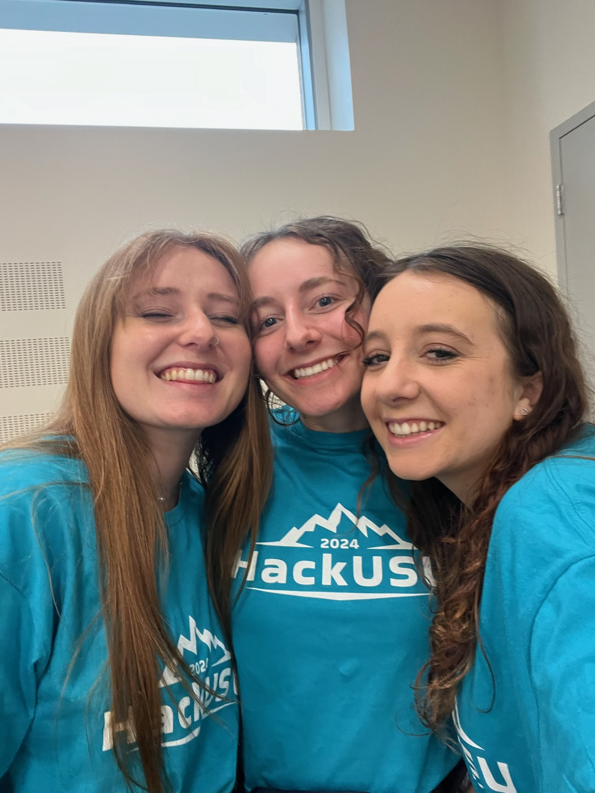
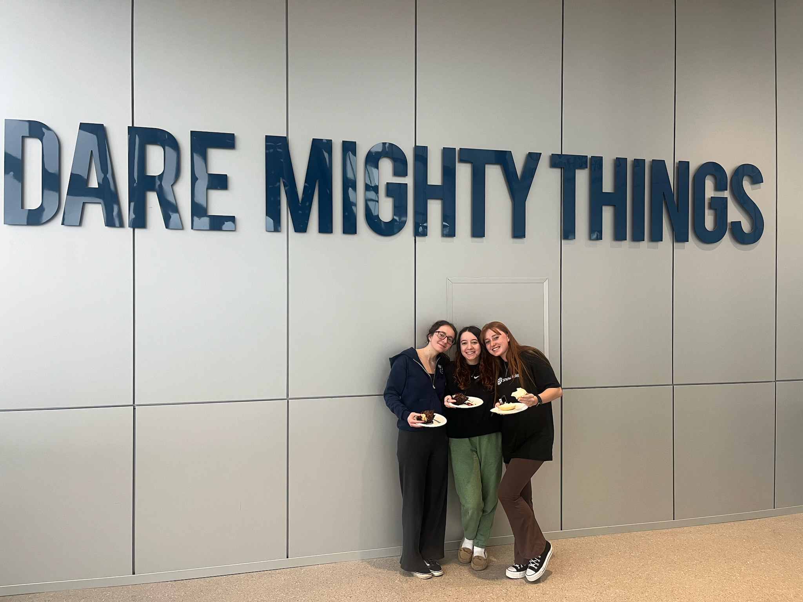

# HackUSU 2024 Team LadyNerds Project

## Project: ML & AI Type 2 Diabetes Predictor

### Teammates

- [Savannah Hilton](https://savcode.co)
- [Chloe Hilton](https://www.linkedin.com/in/chloe-hilton-720016204/)
- Eden Barlow

### Chosen Quickstart
[Intro to Machine Learning with Snowpark ML](https://quickstarts.snowflake.com/guide/intro_to_machine_learning_with_snowpark_ml_for_python/#0)

### Problem Statement
Developing a Machine Learning model to predict the risk of diabetes is crucial for early intervention and personalized healthcare. 
By analyzing individual data such as medical history, activity levels, and overall health, this model aims to provide accurate predictions, empowering individuals and healthcare professionals to take preventive measures and reduce the impact of diabetes on health and resources.
> **⚠️ Disclaimer:**
> 
> This tool may not provide accurate predictions of diabetes risk and should not be used in place of appointments with certified health professionals but should be used as a supplementary tool.
### Data Preparation/Cleaning
We utilized the HealthWise360 DataSet through [Snowflake's Database](https://www.snowflake.com/en/). To clean the data, we:
1. removed user information rows that had null values for the diabetes centile value
2. took out columns that we could not understand the values of, such as the columns using the Wellth tool
3. removed columns with quintile ratings (1-5) as it was not as accurate as the star rating or centile value

### Feature Engineering

### Note

 Unfortunately, the project will only be working during our 30-day free trial begun today on 3/2/2024 since we won't be paying for it in the future.

### Pictures of the Team :)

